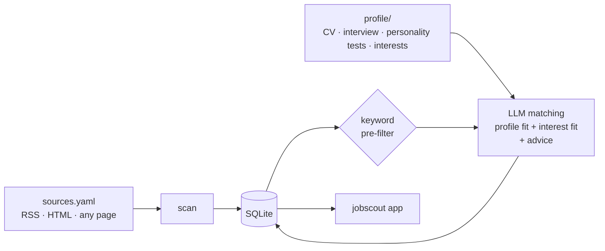

# 🧭 jobscout

**Scan the job sources *you* choose – job boards, company career pages, research-group websites – and let an LLM match every posting against your applicant profile and your interests.**

For each posting jobscout produces:

| | |
|---|---|
| **Profile fit** (0–100) | Do I meet the requirements? |
| **Interest fit** (0–100) | Do I actually want this? |
| **Category** | 🟢 Top match · 🟣 Stretch / dream job · 🟠 Solid option · ⚪ No match |
| **What to emphasize** | Which of your projects and experiences to put forward in the application |
| **Profile tailoring** | Concrete changes to your CV/profile wording for *this* posting |
| **Gaps & red flags** | Missing requirements, eligibility rules, deadlines |

Everything happens in a **local web app**: a setup walkthrough, document upload, an interview that ends in a filled form, a source editor with a test button, the matches with a fit map and an application tracker (new → shortlisted → applied / dismissed), and one-click sync with GitHub. A scheduled GitHub Action scans twice a week.

Works with any LLM supported by [LiteLLM](https://docs.litellm.ai/docs/providers): Claude, OpenAI, Mistral, local models via Ollama, …

---

## How it works



* **Sources** come in three types:
  * `rss` – job feeds (cheapest, most robust)
  * `html` – list pages scraped with CSS selectors, no LLM cost
  * `llm_page` – *any* page (research-group sites, small career pages): the LLM extracts the open positions
* **Profile** is a folder: `profile.yaml` (facts), `interests.yaml` (what you want), `interview_form.yaml` (the interview result) and any number of `.pdf`, `.md`, `.txt` or `.yaml` documents – CV, personality test results, reference letters.
* **Interview**: a chatbot asks what your CV doesn't say and fills in a [fixed form](src/jobscout/templates/interview/form.yaml) – see below.
* **Re-matching**: when your profile changes, stored postings are re-assessed on the next run. Dismissed postings are skipped.

## Privacy by design: two repositories

Your CV and match results are personal. jobscout therefore separates **code** from **data**:

| Repository | Visibility | Contains |
|---|---|---|
| `jobscout` (this repo) | public | code, tests, templates |
| `jobscout-data` (yours) | **private** | `profile/`, `sources.yaml`, `settings.yaml`, `jobscout.db`, the scheduled workflow |

The scheduled scan runs in your **private** data repo, so logs and results never become public.

## Quick start

```bash
pip install "jobscout[app] @ git+https://github.com/Goupus/Jobscout.git"
jobscout app --data-dir ~/jobscout-data
```

The app creates the data folder if it doesn't exist and walks you through the setup:

1. **Profile** – upload your CV (PDF/Markdown) and other documents, fill in your interests.
2. **Interview** – see below.
3. **Sources** – add job boards, career pages and research-group pages; test each one with a click.
4. **Language model** – choose a model and set its API key.
5. **GitHub** – connect the data folder to a private repository (one-time) and press *Save to GitHub*.
6. **First scan** – on GitHub or right in the app.

Want to look around first? `jobscout demo --data-dir ~/jobscout-data` adds fictional matches.

## The interview form

The interview ends in a fixed YAML form (motivation, strengths with evidence, achievements, favourite tasks,
working style, personality, interests, constraints). Two ways to fill it:

* **Any chatbot, no API key** – the app (or `jobscout interview-prompt`) gives you a prompt to paste into
  ChatGPT, Claude, Gemini, … Answer the questions, write *done*, and paste the chatbot's final answer back
  into the app (or `jobscout import-form answer.txt`). The form is validated and stored as `profile/interview_form.yaml`.
* **Chat in the app** – the same interview with your configured model (`jobscout interview` on the command line).

Optionally the form's interests are merged into `interests.yaml`. The prompt is available in
[English](src/jobscout/templates/interview/prompt_en.md) and [German](src/jobscout/templates/interview/prompt_de.md).

## Scheduled scans (twice a week) with GitHub Actions

1. Create a **private** repository, e.g. `jobscout-data`, and push your data folder to it
   (the app shows the commands; `.github/workflows/scan.yml` is already included).
2. `JOBSCOUT_PACKAGE` in `scan.yml` already points to `Goupus/Jobscout` – change it if you use a fork.
3. Add your API key as a repository secret (`ANTHROPIC_API_KEY` or `OPENAI_API_KEY`).
4. The workflow runs **Monday and Thursday** and commits the updated `jobscout.db`.
5. In the app, *Get latest results* pulls the new matches; *Save to GitHub* uploads your profile and source changes.

Your application status and notes live in `tracker.yaml`, separate from the scan database, so syncing never conflicts.
If you also scan locally, the app merges both databases when it pulls.

## Commands

| Command | |
|---|---|
| `jobscout init` | Create a data directory from templates |
| `jobscout scan [--no-match] [--match-only]` | Scan sources and/or match postings |
| `jobscout app` | Open the app |
| `jobscout interview` | Interview with your configured LLM → `interview_form.yaml` |
| `jobscout interview-prompt` | Print the copy-paste interview prompt for any chatbot |
| `jobscout import-form FILE` | Validate and store a chatbot's filled form |
| `jobscout demo` | Insert fictional matches |
| `jobscout status` | Show the last runs |

## Source configuration

```yaml
defaults:                                       # applied to every source
  focus: PhD positions combining chemical engineering and machine learning

sources:
  - name: Process Systems group                 # free text
    type: llm_page                              # rss | html | llm_page
    url: https://uni.example/pse/open-positions
    organization: Example University            # optional default
    include_keywords: [phd, machine learning]   # optional pre-filter
    exclude_keywords: [internship]
    fetch_details: true                         # llm_page: open each posting for the full text
    extra_urls: [https://uni.example/pse/open-positions?page=2]   # more pages, same settings

  - name: Company careers
    type: html
    url: https://example.com/careers
    item_selector: li.job                       # one element per posting
    title_selector: h3
    link_selector: a
    location_selector: .location
```

Please respect each site's terms of use and `robots.txt`. Twice a week is a deliberately gentle default.

## Cost control

* `matching.max_matches_per_run` caps LLM calls per run.
* `matching.prefilter_min_score` (0–1) skips postings with little keyword overlap with your profile.
* `llm.fast_model` uses a cheaper model for extracting postings from pages.
* Only new postings (or all, after a profile change) are matched.

## Development

```bash
pip install -e ".[dev,app]"
pytest
```

Tests use a fake LLM – no API key or network needed.

## Roadmap

- [ ] E-mail / Telegram digest of new top matches after each run
- [ ] Embedding-based pre-filter
- [ ] Draft cover letter / motivation paragraph per posting
- [ ] Ready-made source presets (EURAXESS, university portals, …)
- [ ] Deadline reminders
- [ ] German UI

## License

MIT
