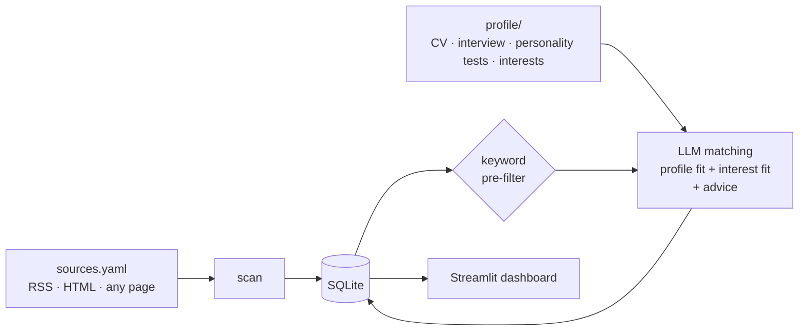

# 🧭 jobscout

**Scan the job sources *you* choose – job boards, company career pages, research-group websites – and let an LLM match every posting against your applicant profile and your interests.**

For each posting jobscout produces:

| | |
|---|---|
| **Profile fit** (0–100) | Do I meet the requirements? |
| **Interest fit** (0–100) | Do I actually want this? |
| **Category** | 🟢 Top match · 🟣 Stretch / dream job · 🟠 Solid option · ⚪ No match |
| **What to emphasize** | Which of your projects and experiences to put forward in the application |
| **Profile tailoring** | Concrete changes to your CV/profile wording for *this* posting |
| **Gaps & red flags** | Missing requirements, eligibility rules, deadlines |

Results are shown in a Streamlit dashboard with a fit map, filters and an application tracker (new → shortlisted → applied / dismissed). A scheduled GitHub Action scans twice a week.

Works with any LLM supported by [LiteLLM](https://docs.litellm.ai/docs/providers): Claude, OpenAI, Mistral, local models via Ollama, …

---

## How it works



* **Sources** come in three types:
  * `rss` – job feeds (cheapest, most robust)
  * `html` – list pages scraped with CSS selectors, no LLM cost
  * `llm_page` – *any* page (research-group sites, small career pages): the LLM extracts the open positions
* **Profile** is a folder: `profile.yaml` (facts), `interests.yaml` (what you want) and any number of `.md`, `.txt` or `.pdf` documents – CV, personality test results, reference letters, interview summaries.
* **Interview**: `jobscout interview` lets the LLM ask you about what your CV doesn't say (motivation, preferred environment, dealbreakers) and saves a summary into your profile.
* **Re-matching**: when your profile changes, stored postings are re-assessed on the next run. Dismissed postings are skipped.

## Privacy by design: two repositories

Your CV and match results are personal. jobscout therefore separates **code** from **data**:

| Repository | Visibility | Contains |
|---|---|---|
| `jobscout` (this repo) | public | code, tests, templates |
| `jobscout-data` (yours) | **private** | `profile/`, `sources.yaml`, `settings.yaml`, `jobscout.db`, the scheduled workflow |

The scheduled scan runs in your **private** data repo, so logs and results never become public.

## Quick start (local)

```bash
pip install "jobscout[dashboard] @ git+https://github.com/__OWNER__/__REPO__.git"

jobscout init --data-dir ~/jobscout-data   # creates settings, sources, example profile
jobscout demo --data-dir ~/jobscout-data   # optional: fictional matches to try the UI
jobscout dashboard --data-dir ~/jobscout-data
```

Then make it yours:

1. Replace the example files in `profile/` with your CV (`cv.pdf` or `cv.md`), facts and interests. Add personality test results or other documents as `.md`/`.pdf`.
2. Edit `sources.yaml` – the shipped URLs are examples.
3. Pick a model in `settings.yaml` and export the matching key, e.g. `export ANTHROPIC_API_KEY=...`.
4. `jobscout interview` – deepen your profile (optional but recommended).
5. `jobscout scan` – scan and match.

Set `JOBSCOUT_DATA_DIR` to skip `--data-dir` every time.

## Scheduled scans (twice a week) with GitHub Actions

1. Create a **private** repository, e.g. `jobscout-data`, and push your data directory to it
   (`jobscout init` already created `.github/workflows/scan.yml` inside it).
2. In `scan.yml`, set `JOBSCOUT_PACKAGE` to this repository (replace `__OWNER__/__REPO__`).
3. Add your API key as a repository secret (`ANTHROPIC_API_KEY` or `OPENAI_API_KEY`).
4. The workflow runs **Monday and Thursday** and commits the updated `jobscout.db`. Trigger it manually via *Actions → jobscout scan → Run workflow*.
5. To review: `git pull` in your data repo and run `jobscout dashboard`.

## Commands

| Command | |
|---|---|
| `jobscout init` | Create a data directory from templates |
| `jobscout scan [--no-match] [--match-only]` | Scan sources and/or match postings |
| `jobscout interview` | LLM interview that adds to your profile |
| `jobscout dashboard` | Open the Streamlit dashboard |
| `jobscout demo` | Insert fictional matches |
| `jobscout status` | Show the last runs |

## Source configuration

```yaml
sources:
  - name: Process Systems group                 # free text
    type: llm_page                              # rss | html | llm_page
    url: https://uni.example/pse/open-positions
    organization: Example University            # optional default
    include_keywords: [phd, machine learning]   # optional pre-filter
    exclude_keywords: [internship]
    fetch_details: true                         # llm_page: open each posting for the full text

  - name: Company careers
    type: html
    url: https://example.com/careers
    item_selector: li.job                       # one element per posting
    title_selector: h3
    link_selector: a
    location_selector: .location
```

Please respect each site's terms of use and `robots.txt`. Twice a week is a deliberately gentle default.

## Cost control

* `matching.max_matches_per_run` caps LLM calls per run.
* `matching.prefilter_min_score` (0–1) skips postings with little keyword overlap with your profile.
* `llm.fast_model` uses a cheaper model for extracting postings from pages.
* Only new postings (or all, after a profile change) are matched.

## Development

```bash
pip install -e ".[dev,dashboard]"
pytest
```

Tests use a fake LLM – no API key or network needed.

## Roadmap

- [ ] E-mail / Telegram digest of new top matches after each run
- [ ] Embedding-based pre-filter
- [ ] Draft cover letter / motivation paragraph per posting
- [ ] Ready-made source presets (EURAXESS, university portals, …)
- [ ] Deadline reminders

## License

MIT
